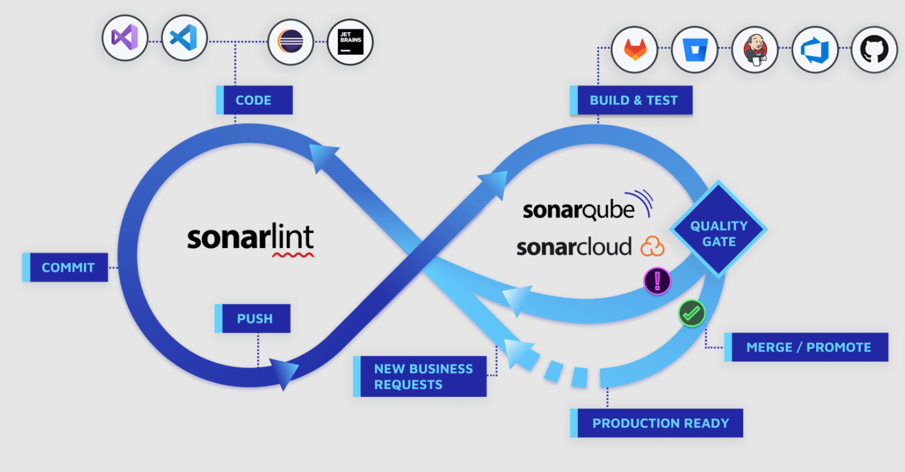

# SonarQube 10.4 Documentation
[SonarQube](https://www.sonarsource.com/products/sonarqube/) is a self-managed, automatic code review tool that systematically helps you deliver Clean Code. As a core element of our [Sonar solution](https://www.sonarsource.com/), SonarQube integrates into your existing workflow and detects issues in your code to help you perform continuous code inspections of your projects. The product analyses [30+ different programming languages](https://rules.sonarsource.com/) and integrates into your [Continuous Integration](https://docs.sonarsource.com/sonarqube/latest/analyzing-source-code/ci-integration/) ([CI)](https://docs.sonarsource.com/sonarqube/latest/analyzing-source-code/ci-integration/overview/) pipeline of [DevOps platforms](https://docs.sonarsource.com/sonarqube/latest/devops-platform-integration/github-integration/) to ensure that your code meets high-quality standards.

# Writing clean code

[Clean Code](https://www.sonarsource.com/solutions/clean-code/) is the standard for all code that results in secure, reliable, and maintainable software therefore, writing clean code is essential to maintaining a healthy codebase. This applies to all code: source code, test code, infrastructure as code, glue code, scripts, and more. For details, see [Clean Code](https://docs.sonarsource.com/sonarqube/latest/user-guide/clean-code/introduction/).

Sonar's [Clean as You Code](https://docs.sonarsource.com/sonarqube/latest/user-guide/clean-as-you-code/) approach eliminates many of the pitfalls that arise from reviewing code at a late stage in the development process. The Clean as You Code approach uses your [quality gate](https://docs.sonarsource.com/sonarqube/latest/user-guide/quality-gates/) to alert/inform you when there’s something to fix or review in your [new code](https://docs.sonarsource.com/sonarqube/latest/project-administration/clean-as-you-code-settings/defining-new-code/) (code that has been added or changed), allowing you to maintain high standards and focus on code quality.

[Developing with Sonar](https://docs.sonarsource.com/sonarqube/latest/#developing-with-sonar)

